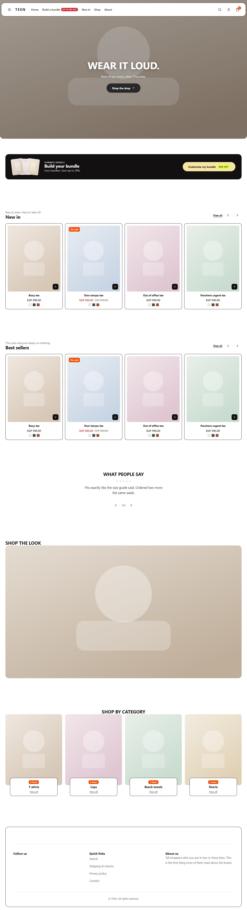
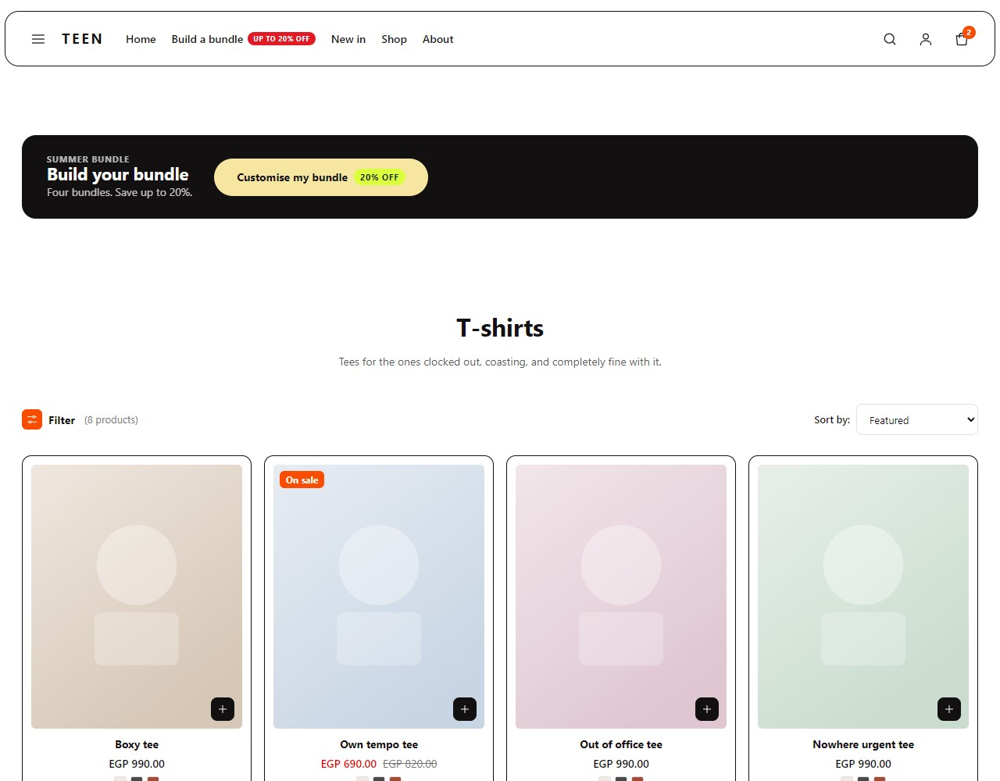
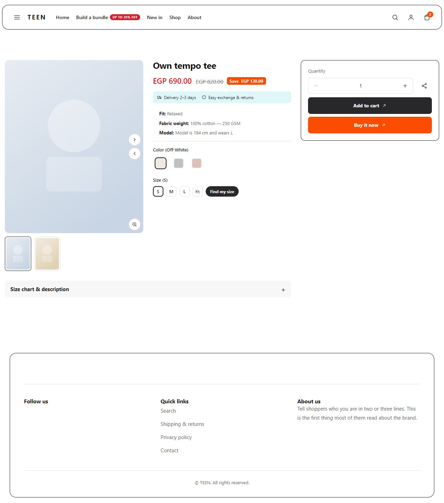
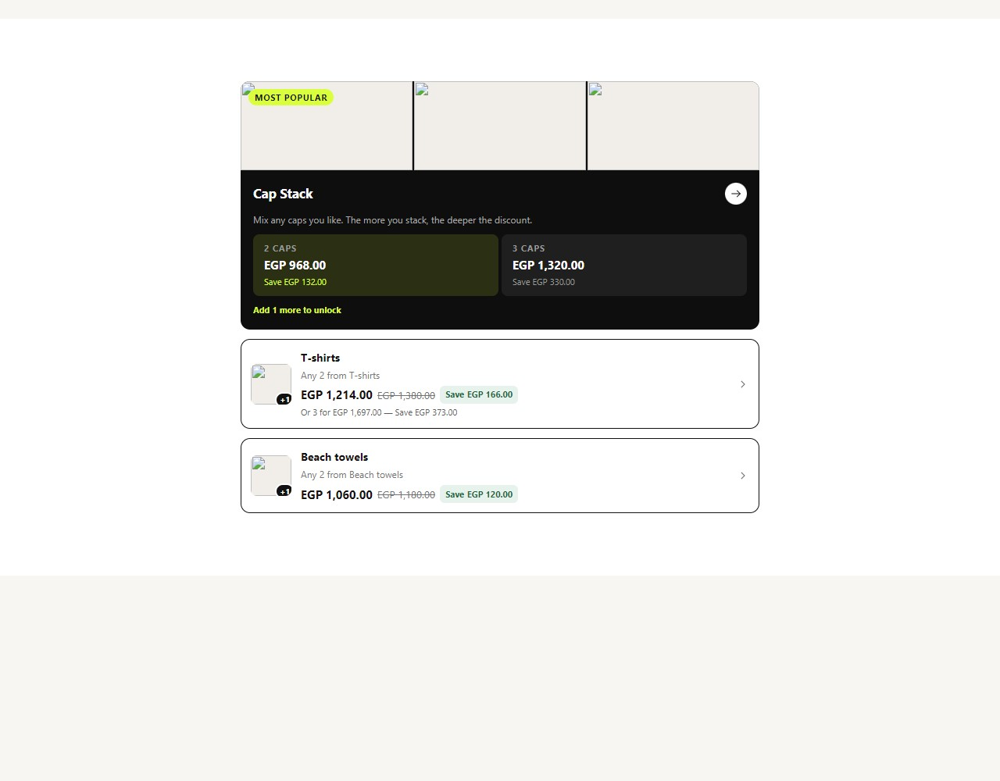
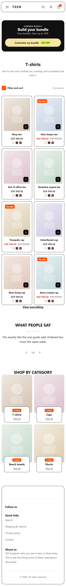
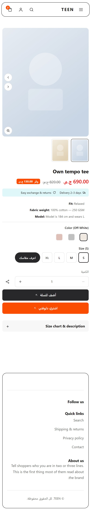

# Teen — marketplace listing copy

Paste-ready copy for the NUMU theme marketplace. Version **1.0.0**.
Preview images are in `preview/` and are referenced below.

---

## Name

**EN** Teen
**AR** تين

## One-line

**EN** A loud, card-led storefront for streetwear that sells in bundles.
**AR** متجر جريء ومبني على الكروت، لستريت وير بيتباع باندلات.

## Short description (≤ 200 chars)

**EN**
Hairline cards, hover-swap photography and grid quick-add, wrapped around a real multibuy bundle
page. Built for Egypt: Arabic-first, WhatsApp-first, COD-ready.

**AR**
كروت بخطوط رفيعة، وصور بتتبدل عند اللمس، وإضافة سريعة من الشبكة — حوالين صفحة باندل حقيقية.
متعملة لمصر: عربي أولًا، واتساب أولًا، وجاهزة للدفع عند الاستلام.

---

## Long description

**EN**

Teen is built for a store that sells more than one thing at a time. Its centre of gravity is the
**Build-a-Bundle page**: it reads your live multibuy promotions and lays them out as a chooser —
tiers side by side, the saving on each, and a progress line that updates as the shopper fills their
bag. Every price on that page comes from the promotion engine. The theme never types a number in,
so what the page promises is what the checkout charges.

Around that sits a fast, dense catalogue. Product cards are hairline-outlined with a pale plate that
crossfades to a second photo on hover, a colour-swatch row, and a quick-add that opens a real size
picker rather than guessing. The listing filters and sorts entirely in the browser — nine sort
options, facets built from the colours and sizes your products actually carry, and a mobile sheet
that folds sort and filter into one control.

The product page is driven by the product, not by settings. A cap with a colour axis gets swatches
and no size row. A towel with one fixed size gets one chip. A tee gets a spec list, size buttons and
a link to your size guide — and that link only appears when there is actually a chart behind it.
Add a colour to a product and the swatches appear on save; there is nothing to switch on.

It is an Egyptian theme, not a translated one. Every string ships in English and masri Arabic, the
whole layout mirrors in RTL, WhatsApp is the first contact channel on the contact page and the order
confirmation, and prices render the way Egyptian shops write them.

**AR**

تين متعملة لمتجر بيبيع أكتر من حاجة في المرة الواحدة. قلبها هو **صفحة الباندل**: بتقرا عروض
"اشتري كذا بكذا" الشغالة عندك وتعرضها كقايمة اختيار — الشرايح جنب بعض، والتوفير على كل واحدة، وسطر
بيتحدث مع الزبون وهو بيملا سلته. كل سعر في الصفحة دي جاي من محرك العروض؛ الثيم مش بيكتب رقم بإيده،
فاللي الصفحة بتوعد بيه هو اللي الدفع بيحسبه.

وحوالين ده كتالوج سريع ومركّز. كروت المنتجات بخطوط رفيعة وصورة بتتبدل لتانية عند اللمس، وصف ألوان،
وإضافة سريعة بتفتح اختيار مقاس حقيقي بدل ما تخمّن. الفلترة والترتيب بيحصلوا في المتصفح — تسع طرق
ترتيب، وفلاتر متبنية من الألوان والمقاسات اللي منتجاتك فيها فعلًا، وشيت على الموبايل بيجمع الترتيب
والفلترة في زرار واحد.

صفحة المنتج بيحددها المنتج، مش الإعدادات. الكاب اللي ليه ألوان بيطلع بسواتشز من غير صف مقاسات.
والفوطة اللي ليها مقاس واحد بتطلع بشريحة واحدة. والتيشيرت بيطلع بقايمة مواصفات وأزرار مقاسات ورابط
لدليل المقاسات — والرابط ده بيظهر بس لما يكون فيه جدول فعلًا وراه.

ودي ثيم مصرية، مش مترجمة. كل الكلام بيجي بالإنجليزي وبالعامية المصرية، والتصميم كله بيتقلب في الـRTL،
والواتساب هو أول قناة تواصل في صفحة "كلمنا" وفي تأكيد الطلب، والأسعار بتتكتب زي ما المحلات المصرية
بتكتبها.

---

## What it ships

**21 sections across 17 templates.**

| Group | Sections |
|---|---|
| Chrome | floating capsule header (3-tier nav, drawer, promo badge, bundle pill) · footer (newsletter, columns, mobile accordion, payment marks) |
| Home | campaign hero · bundle banner · product rail · review strip · shop-the-look with hotspots · collection links |
| Catalogue | product listing (serves both a collection and all-products) · all-collections · search |
| Product | product page with gallery, zoom, variant-driven pickers, accordions, related rail and a sticky mobile buy bar |
| Commerce | bag (empty + full, free-shipping bar, discount code) · **Build-a-Bundle** |
| Content | about · contact · FAQ · account · order confirmation · branded 404 · size guide |

**Also in the box**

- **Bilingual out of the box** — English and masri Arabic, complete RTL.
- **Server-rendered** — every template renders on the server in both languages.
- **Self-hosted fonts** — Raleway + IBM Plex Sans Arabic, no third-party font connection.
- **Motion respects the shopper** — `prefers-reduced-motion` and a merchant switch, both landing
  content in its finished state.
- **44.7 KB gzipped.**

---

## Who it is for

**A good fit if** you sell apparel or accessories, you run multibuy offers ("any 3 for 650"), and
your photography is decent but not editorial. Teen is loud on purpose — it uses colour to sell.

**A poor fit if** you want a quiet, monochrome, gallery-style store. That is what Genova is for.

---

## Before you launch — three things need setting up

Teen deliberately hides features it cannot honour, so if something is missing this is usually why:

1. **The Build-a-Bundle page is empty until you create a multibuy promotion.** Create it under
   Marketing → Promotions, with the products set as the offer's **buy-set**. The page then fills
   itself in — there is nothing to type.
2. **The newsletter block and the contact form both need a form endpoint** (Formspree, Getform, a
   Google Form, or your own). NUMU has no built-in one, so rather than posting your customers'
   messages into a void, both hide themselves until you supply a URL. WhatsApp, phone and email work
   without one, and you do not have to type them twice: the contact page uses the details already on
   your store (Settings → WhatsApp / phone / email) unless you override them on the section.
3. **Set your store-wide size chart** under Settings. The size-guide page and every product's size
   accordion read from it, so it is one place, once.

---

## Screenshots

| | |
|---|---|
|  |  |
|  |  |
|  |  |

> **About these previews:** they are real renders of the theme, captured from the shipped bundle at
> 1280 px and 390 px. The **photography is placeholder art**, not a real catalogue — Teen has no
> launch merchant yet. Re-shoot them against a live store before the theme goes in front of buyers;
> a marketplace preview showing abstract panels undersells a theme whose whole job is framing
> photographs.

---

## Technical notes for review

- `numu-theme lint --strict` clean · `check` valid, 0 warnings · `verify` 7/7 templates in EN and
  7/7 in AR.
- Lighthouse: accessibility **96**, best practices **100** (mobile, listing page).
- Document semantics verified across all 34 renders (16 templates × 2 locales + 2 state variants):
  one `<h1>` and one `<main>` each, no skipped heading levels, no unnamed control.
- `federate: true`, `sdk_compat_minor` 13, SSR bundle present.
- **One deliberate WCAG AA exception:** white on the brand orange `#fb4d01` measures 3.41:1 against
  AA's 4.5 for 12 px bold. It is the theme's signature pill, it never carries information on its own,
  and both sides are merchant-controllable (`button_color` / `button_text_color`) — so a store that
  needs AA here can have it without a theme change.
- **The bundle page has no server-rendered content.** Promotions are fetched client-side; the
  storefront ships none in the page payload and the SDK's hook is client-only. This is a platform
  limit, not a theme choice.

## Assets outstanding

- Demo imagery for the marketplace "Try theme" preview (`FALLBACK_*` paths under
  `cdn.numueg.app/theme-assets/teen/`) has not been produced or uploaded.
- Previews should be re-shot against a real catalogue — see the note above.
